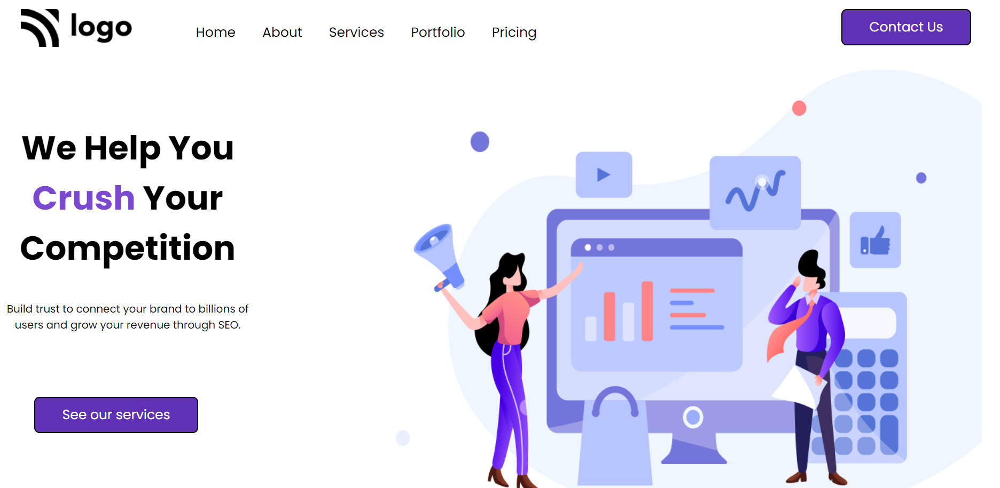

# project-04 #
[project-live](https://fswd-project4.netlify.app)
   - - - -
 # Technology used in this project #
     
    - - - -
* Skill Gained in this project
  * Learned to used flex for  align the content in row and column using __flex-direction__
  *  Learned to give __width , height__ to the image.
  * Learned to create button using __padding__  and __border radius__
  * Learned convert list into navbar section using __flex__ and bullet point remote using
  __list-style-type:none__
  * Learned about the changing position using  __margin__,  etc.
   - - - -
 ## Time taken to complete this project ##
 * 2 to 4 hrs  to completed this poject
 
 ## Screenshot ##
 
 
